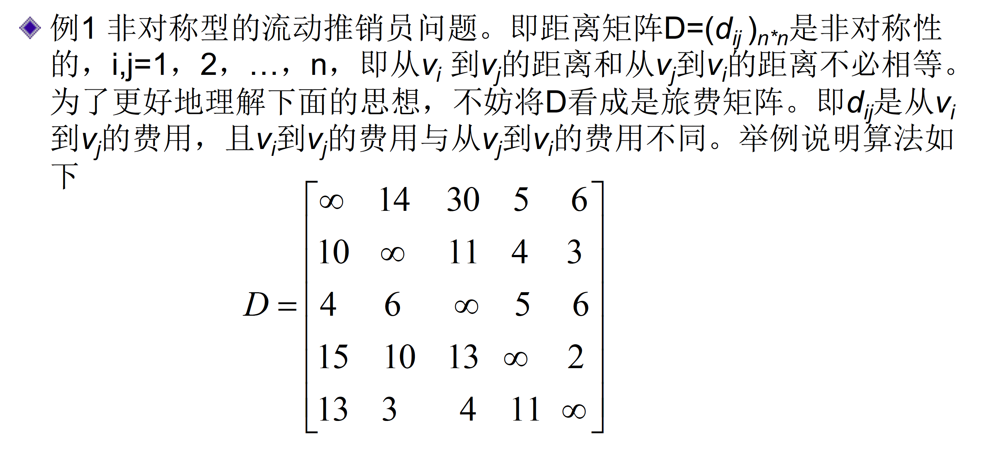

# 第二章 分支策略与分支定界

## 分治法

将原问题划分成n个规模较小而结构与原问题相似的子问题；递归地解决这些子问题，然后再合并其结果，就得到原问题的解。

共有三个步骤

+ 分解(Divide): 将原问题分解成一系列子问题
+ 解决(Conquer): 递归地解各子问题。若子问题足够小，则直接求解
+ 合并(Combine): 将子问题的结果合并成原问题的解

### 归并排序

过程解释

MERGE过程正确性

+ 初始化：在for循环的迭代开始之前，k=p，A[p..k-1]是空的，又i=j=1，L[i]和R[j]是L、R中，尚未被复制回数组A的最小元素。
+ 保持：假设L[i]≤R[j]，L[i]是L、R中未被复制回数组A的最小元素。又A[p..k-1]包含了k-p个最小的元素，因此，第14行将L[i]复制到A[k]中后，子数组A[p..k]将包含k-p+1个最小的元素。假设L[i]>R[j]，R[j]是L、R中未被复制回数组A的最小元素。又A[p..k-1]包含了k-p个最小的元素，因此，第16行将R[j]复制到A[k]中后，子数组A[p..k]将包含k-p+1个最小的元素。
+ 终止：在终止时，k=r+1。根据循环不变式，子数组A[p..k-1]为A[p..r]，包含了L和R中k-p=r-p+1个最小元素，并且是已排好序的。

归并排序复杂度的表示与求解

## 分治策略与递归分析

递归式的求解方法

+ 代换法(substitution method)
+ 递归树方法(recursion-tree-method)
+ 主方法(master method)

### 快速排序

就地排序，然后期望运行时间短，复杂度常数项较小

#### 正确性

使用循环不变式证明

#### 划分与复杂度

每一次划分的结果会影响运行时间，常数比的划分下，算法的复杂度永远为$O(n\lg n)$

不被特殊的情况所影响：引入随机化的策略

#### 平均运行时间分析

快速排序中的操作包括交换和比较，交换的次数不会多于比较的次数，因此考虑元素间比较的次数

定义指示器随机变量

$$
X_{ij}=I \left\{ z_i与z_j进行比较\right\}
$$

在这里$z_i$表示数组排序以后第$i$小的元素

由于每个元素只和主元元素进行比较，而且之后该主元元素不会再跟其他元素比较了，因此总的比较次数

$$
X=\sum^{n-1}_{i=1}\sum^{n}_{j=i+1} X_{ij}
$$

元素间最多比一次

$\mathrm{E}[X]=E\left[\sum_{i=1}^{n-1} \sum_{j=i+1}^{n} X_{i j}\right]=\sum_{i=1}^{n-1} \sum_{j=i+1}^{n} E\left[X_{i j}\right]=\sum_{i=1}^{n-1} \sum_{j=i+1}^{n} \operatorname{Pr}\left\{z_{i}\right.$ 与 $\mathrm{z}_{\mathrm{j}}$ 进行比较 $\}$

考虑到如果能进行比较，$z_i$和$z_j$需要在统一划分中，此时$Z_{ij}$所有元素都在一个划分里，接下来排序的时候它们被选为主元是等概率的，换句话说头尾被第一个选成主元的概率是$\operatorname{Pr}\left\{z_{i}\right.$ 与 $\mathrm{z}_{\mathrm{j}}$ 进行比较 $\}=\frac{2}{j-i+1}$

我们可以得到

$$
\mathrm{E}[X]=\sum_{i=1}^{n-1} \sum_{j=i+1}^{n} \frac{2}{j-i+1}
$$

通过放缩可以得到$O(n\lg n)$复杂度的结果

### 最大子数组和问题

四种复杂度的算法

### 空间最近点对问题

排序，分治左右两边。
最多个7个点进行比较

### 矩阵乘法的Strassen算法

$T(n)=\left\{\begin{array}{l}\theta(1) \\ 7 T(n / 2)+\theta(n^2)\end{array}\right.$

## 代换法与主方法

三种递归式的求解方法

### 递归树方法

### 代换法

步骤

1. 通过猜测确定其界
2. 对边界条件成立

递归式验证的时候，先说明右边满足不等式成立的条件下，左边也满足同样的不等式。

举例：

找出常数$n_0=2$满足条件

#### 经验trick

减掉一个低阶项

**原因**: 小于等于的不等式如果右边出现低阶正项就不容易处理了，但是右边的项往往比较多，可以在不影响整体复杂度的上面抵消这个低阶项

改变变量

**原因**：存在根号的情况下不好递归，可以转化成指数型的表示，这样根号就转换成了除法运算

### 主方法

关于递归式$T(n)=aT(n/b)+f(n), a \geq 1, b \gt 1 $的通用解法，在这里$n/b$指$\lfloor n/b \rfloor$或$\lceil n/b \rceil$

1. 若对于某常数$\varepsilon \gt 0$， 有$f(n)=O(n^{\log_b{a}-\varepsilon})$，则$T(n)=\Theta(n^{\log_b a})$
2. 若$f(n)=\Theta(n^{\log_b a})，$则$T(n)=\Theta(n^{\log_b a} \lg n)$
3. 若对于某常数$\varepsilon \gt 0$，有$f(n)=\Omega(n^{\log_b{a}+\varepsilon})$，且对常数$c < 1$与所有足够大的$n$，有$af(n/b)\leq cf(n)$，则$T(n)=\Theta(f(n))$

#### 注解

1. 三种情况都把函数$f(n)$与函数$n^{\log_b a}$进行比较。我们的直觉是解由两个函数中较大的一个决定。
2. 第一种情况中，不仅要有$f(n)$小于$n^{\log_b a}$，还必须是多项式小于$n^{\log_b a}$，即对某个常量$\varepsilon>0$，f(n)必须渐进地小于$n^{\log_b a}$，两者差因子$n^\varepsilon$, 第三种情况中，$f(n)$不仅要大于$n^{\log_b a}$，且要多项式地大于$n^{\log_b a}$，还要满足“规则性”条件$af(n/b)\le cf(n)$。
3. 三种情况没有覆盖所有可能的$f(n)$

## 排序和顺序统计

### 线性时间排序

### 中位数和顺序统计学

#### RANDONMIZED-SELECT算法

寻找第$i$个顺序统计量，采用分治，以**quick-sort**作为模型，期望时间为$\Theta(n)$

#### SELECT算法

使用更好的划分策略

1. 将输入数组的n个元素划分为⌈n/5⌉组，每组5个元素，且至多只有一个组由剩下的n mod 5个元素组成
2. 寻找⌈n/5⌉个组中每一组的中位数，首先对每组中的元素（至多为5个）进行插入排序，然后从排序过的序列中选出中位数
3. 对第2步中找出的⌈n/5⌉个中位数，递归调用SELECT以找出其中位数x
4. 用x来进行划分，递归调用**SELECT**以找出第$i$小的元素

递归式

$$
T(n) = \left\{ \begin{array}{c} \Theta(1) \text{ if } n\leq140 \\ T(\lceil n/5 \rceil)+T(7n/10+6)+O(n) \text{ else} \end{array} \right .
$$

证明略

### 线性时间排序

排序的最理想情况$\Omega(n \lg n)$，使用二叉决策树可以得到证明

#### 计数排序

满足每一个元素在0到k之间，此外$k=O(n)$，在算法中输入数组为$A[1,...,n]$，我们将排序结果放到$B[1,...,n]$，临时空间开辟为$C[1,...,k]$

思路：用$C$数组统计每一组出现的个数，然后从小到大累加，计算出小于等于某数的个数，再直接分配位置，分配是逆序的，这样保证了相同元素相对次序在排序前后相同

#### 基数排序

总共有$n$个数，由最低位开始到最高位，每一位做一次计数排序

#### 桶排序

假设输入由一个随机过程，元素均匀分布在$[0,1)$的区间上（可以解决之前排序解决不了的浮点数问题）

把所有的数放到等距划分的桶里，所有的数散落到桶里，每一个桶进行局部排序，最后汇集结果

算法的正确性是显而易见的，下面是期望运行时间的证明，考虑子排序是插入排序

$$
T(n)=\Theta(n)+\sum^{n-1}_{i=0} O(n^2_i)
$$

利用期望的线性性质

$$
\begin{aligned}
E[T(n)]&=E\left[\Theta(n) + \sum^{n-1}_{i=0}O(n^2_i) \right]\\
&=\Theta(n) + \sum^{n-1}_{i=0}E \left( O(n^2_i) \right)\\
&=\Theta(n) + \sum^{n-1}_{i=0}O \left( E(n^2_i) \right)
\end{aligned}
$$

可以证明
$E[n_i^2]=2-1/n$

## 分支定界法

### 搜索问题的基本概念

一般的定义

+ 一个$n$元组$x_1,…,x_n$，其中$x_i$是从有限集合$S_i$中选取。通常待解决的问题需要找到一个向量可以最大化（或最小化或满足）一个准则函数（criterion function）$P(x_1,…,x_n)$。
+ **解**
+ **可行解**
+ **最优解**
+ **搜索的过程**

### 状态空间树

树中的节点表示问题的一个状态，其中包括所有的解状态（往往对应叶子节点）。从根到解状态的路径对应求解的过程。

#### 目标

搜索算法的目标：按一定的次序搜索状态空间树（往往是边生成边搜索），希望在找到最优解之前搜索过的节点最少。
三个要素：树结构（解空间、搜索算法表示决定）；搜索次序（搜索策略）；剪枝（合规检查、定界函数）；

#### 节点分类

+ **活跃节点：** 本身生成了，但子节点均未生成。
+ **E节点：** 正在生成子节点的活跃节点。

#### 搜索策略

+ **回溯：** 深度优先生成（搜索）节点，一个节点可以多次成为E节点。
+ **分支定界法𝐸：** 节点一直保持是𝐸节点直到生成完其所有的子节点，一个节点只能成为一次𝐸节点。每个节点可以有一个定界函数，是以该节点为根的子树中所有解的准则函数值的下界（对于最小化问题）或者上界（对于最大化问题），用于选择下一个𝐸节点以及剪枝。
+ **启发式搜索（A\*）：** 节点一直保持是𝐸节点直到生成完其所有的子节点，一个节点只能成为一次𝐸节点。每个节点可以有一个估值函数，是该节点到最终解距离的一个估计，用于选择下一个𝐸节点

#### 分支定界法𝐸

搜索树中每个节点x上都有一个计算好的界，此界是以x为根节点的子树中所有节点所代表的解法的可能值的界。如果一个计算出的界比之前的解法差，则以x为根的子树被剪枝。

##### 流动摊销员问题（TSP）

每一个城市必然会进去一次加出去一次

选取第一行为0的元素作为分界点，生成相应分支并变化矩阵。

从小的矩阵开始进一步的探索，当发现搜索代价过大的时候可以进行剪枝操作。

##### 同顺序加工任务安排问题

设定一个顺序，使得总加工所需时间最小

通过是否安排加工某个任务进行分支，定界估计函数为$t_{i1}+\sum^4_{j=1}t_{j2}+\min_{j \neq i}{t_{j3}}(*)$

$t_{*1}$按照已分配的任务顺序加起来，对于$t_{*2}$是考虑已分配的最后一个的，而$\min t_{*3}$则是排除最后一个的

整一个搜索的过程

+ 分支定界：综合以上几个例子，可以看到分支定界法的基本思想是采用沿最优节点下降的策略，即对每个节点估计一权值，在搜索时利用权值来决定下一搜索节点的有限顺序。一旦搜索到一个解，利用这个解的权值可剪去那些不可能得到更优解的节点，直至所有节点均被搜索或剪去。
+ 分支定界与回溯的区别：分支定界多看一些节点，从中选择最有可能到达最优解的节点深入
+ 分支定界与启发式搜索的区别：启发式搜索算法中由于估值函数是估值，不能用于剪枝。其实启发式搜索就是对穷举的一种优化，让每次搜索都更接近目标。这就要通过估值函数实现，对于这类问题，找到一个估值函数是关键。

#### 启发式搜索（A\*）

每个节点的估值函数F由两部分组成：从出发点到该节点的实际距离G；以及从该节点到目标点的估计距离H

1. 把起点加入到openlist中（活跃节点组成）
2. 重复以下步骤
    a. 从openlist中找出F最小的节点，并把它当做当前的操作节点
    b. 检查当前点周围的点，如果已经在openlist中看是否能通过当前点得到更小的G，如果能就更新那个点的G，F的值，如果在closelist中或者是障碍物（不可达）则忽略他们
    c. 把当前点从openlist中移除，加入closelist中
    d. 当目标点加入closelist中时停止
3. 保存路径，从目标点出发，按照父节点指针遍历，直到找到起点。

