# 第三章 贪心算法

## 概念

贪心算法是使所作的选择看起来都是当前最佳的，期望通过所作的局部最优选择来产生一个全局最优解

两种方法可以用来证明一个贪心算法对问题提供了最优解
+ 贪心领先：一步接一步的方式测量贪心算法，每一步结束之后都比其他的算法优；
+ 交换论证：任何可能的最优解，逐渐把它转换成由贪心算法找到的解且不损害他的最优性

## 贪心问题

### 区间调度

按结束时间从小到大排列，再去选择其中相容的集合

#### 正确性证明

归纳法，贪心算法部分解一直领先于最优解

然后用反证法，如果最优解的个数比贪心要多，肯定有一个任务在贪心中没有被分配

### 最小延迟调度

#### 正确性证明

考虑一个最优调度𝑂，我们的证明方式是逐步修改𝑂，每步保持它的最优性，最终把它转换成一个与贪心算法得到的调度𝐴相等的调度。这种类型的分析方法叫做交换论证，这是一种考虑一般性贪心算法的有效方法

略

### 最优缓存算法

遵循最远将来原则

When 𝑑𝑖 需要被放入缓存
    收回在最远的将来被需要的那一项

#### 正确性证明

略

### 图的最短路径

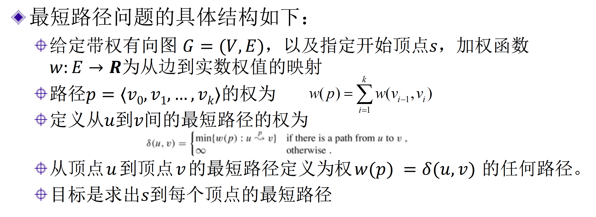

#### Dijkstra

图上所有边的权值非负，起点到所有节点的最短路径

运用循环不变式去证明，每一个新加入的节点都是最短路径

### 最小生成树

**割性质**：假设所有边费用不等，$(𝑆, 𝑉 − 𝑆)$是集合$𝑉$的一个划分。如
果边$𝑒 = (𝑣,𝑤) \in 𝐸$是一端点位于集合$𝑆$，另一端点位于集合$𝑉 − 𝑆$的
最小费用边，那么每棵最小生成树都包含边$𝑒$。

反证法，如果不包含$e$，肯定存在$e^{'}$连接这两部分，然后证明替换以后仍然满足树的性质，这样代价还要小。

证明每一条加入的边都满足割性质就可以证明是最小生成树了。

#### Prim算法

Prim算法实际每步已经构造了一棵顶点集为$𝑆 ⊆ 𝑉$的部分生成树，同时添加的是连接$(𝑆, 𝑉 − 𝑆)$的花费最小的边。

#### Kruskal算法

因为Kruskal算法按费用增加顺序加入，$𝑒$是当时一端点在$𝑆$而另一端点在$𝑉 − 𝑆$中的费用最低边

#### 逆向删除算法

#### 并查集

Kruskal判断是否成环的结构

### 聚类

Kruskal提早结束

### 哈夫曼编码

赫夫曼设计了一个可用来构造一种称为赫夫曼编码的最优前缀码的贪心算法

+ 输入：一个包含$𝑛$个字符的集合$𝐶$
+ 过程：自底向上方式，从$|𝐶|$个叶节点的集合开始，依次执行$|𝐶| − 1$次“合并”操作来构造最终的树。
+ 输出：前缀编码二叉树的根

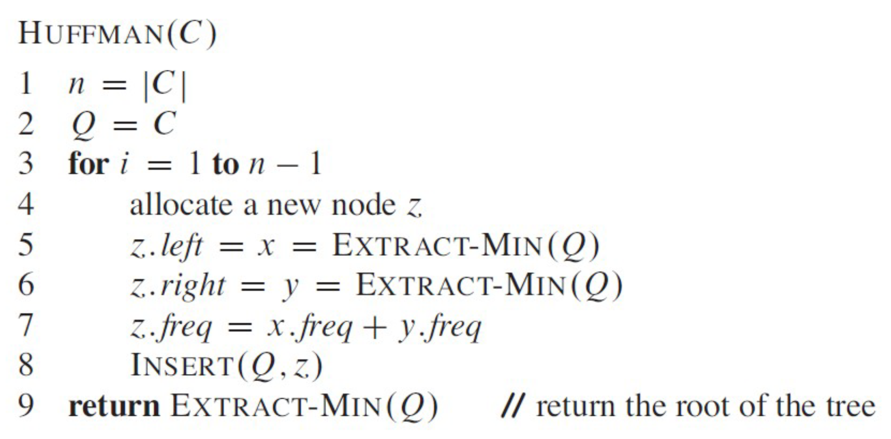

+ 𝑄是一个以𝑓为关键字的最小优先级队列，用来识别出要合并的两个频度最低的对象。
+ 第2行以𝐶中的字符对最小优先级队列𝑄进行初始化
+ 第3~8行的for循环反复取出队列中具有最低频度的两个节点𝑥和𝑦，并用将它们合并后所得的𝑧插入队列中以替换它们
+ 𝑧的频度在第7行中计算，为𝑥和𝑦的频度之和
+ 新节点𝑧以𝑥和𝑦为其左右节点
+ 𝑛 − 1次合并后，于第9行返回
+ 对我们的例子，执行过程见下页

总运行时间为$O(n \log n)$

#### 正确性证明

首先证明：命题，设$𝐶$为一字母表，其中每个字符$𝑐 ∈ 𝐶$具有频度$𝑐$. $𝑓𝑟𝑒𝑞$。设$𝑥$和$𝑦$为$𝐶$中具有最低频度的两个字符，则存在$𝐶$的一种最优前缀编码，其中$𝑥$和$𝑦$的编码长度相同但最后一位不同。

然后你去证明，如果把最下面两个给替换成频率和为$z$的节点，这样的字母表下最优结构就是原来的最优结构，接着就是数学归纳法了

### 最小费用有向树

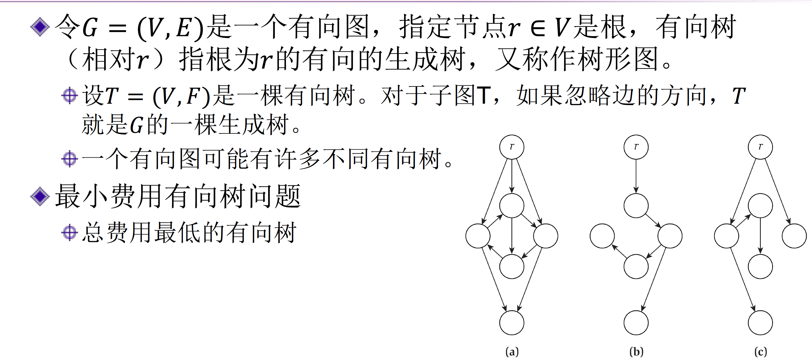
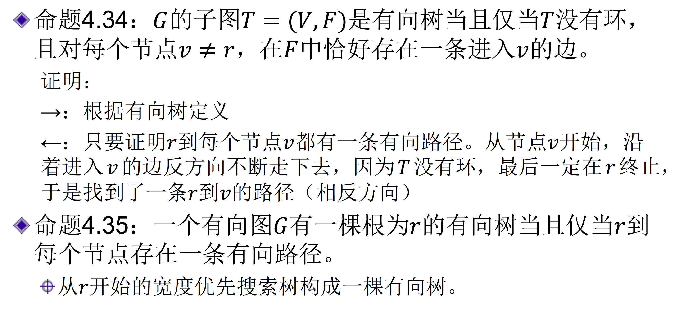

**贪心策略**

对每个节点，选择进入u的费用最
低的边（如果有多条边，可任选一条）。
令$𝐹∗$是$𝑛 − 1$条边的集合，构成子图$(𝑉, 𝐹∗)$
命题4.36：如果$(𝑉, 𝐹∗)$是一棵有向树，那么它是一棵最小费用有向树。
显然成立
但$(𝑉, 𝐹∗)$可能存在环（不可能包含根r），需要处理这种情况。

在这里成环以后所有权值均为0，可以塌缩成一个超节点

新图如果成为了一个最小费用有向树，展开的时候指向超节点的边被删去

#### 正确性证明

命题4.38：令𝐶是𝐺中一个由费用为0的边构成的环，且𝑟 ∉ 𝐶，那么存在一棵最优有向树，它恰好有一条边进入𝐶。

用反证法，如果有两条，通过替换找到更有的方案

接下来证明𝑇′是一棵有向树。

因为𝑇′中除𝑟外的每个节点𝑣都只有一条边进入𝑣，𝑇′是一棵树。
接下来证明𝑇′中𝑟到每个𝑣 ≠ 𝑟都存在一条路径。
考虑任何节点𝑣 ≠ 𝑟，如果𝑣 ∈ 𝐶，路径为𝑟先到达𝑒再通过𝐶中的边到达𝑣。如果𝑣 ∉ 𝐶，令𝑃表示在𝑇中的𝑟 − 𝑣路径。如果𝑃不通过𝐶，那么它在𝑇′中依旧能到达。否则，令𝑤为𝑃路径上与𝐶相交的最后一个节点，𝑃′是𝑇中𝑤到𝑣的路径， 𝑇′中𝑟到𝑣的路径为先到达𝐶上的𝑤节点再通过𝑃′到𝑣。因此𝑇′是一棵有向树。
综上𝑇′是一颗最优有向树

## 拟阵

贪心法的理论基础

### 定义

满足下列条件的一个序对$M = (S,ℓ)$ ：

1. $S$是有限非空集合
2. $ℓ$是$S$的一个非空子集族，称为$S$**的独立子集**，使得如果$B ∈ℓ$且$A⊆ B$，那么$A ∈ℓ$。我们说$ℓ$**是遗传的**，如果它满足这个性质
3. 如果$A ∈ℓ, B ∈ℓ$，且$|A| < |B|$，则有某个元素$x ∈ B - A$使得$A∪{x}∈ℓ$。我们称$M$**满足交换性质**。

### 拟阵的例子

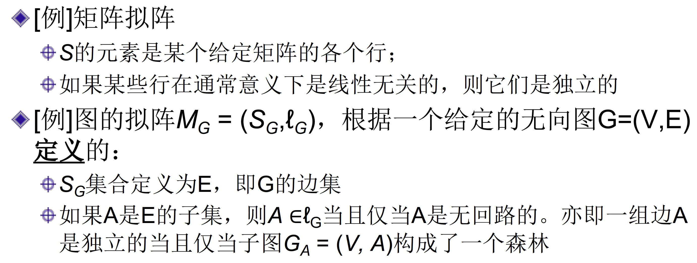
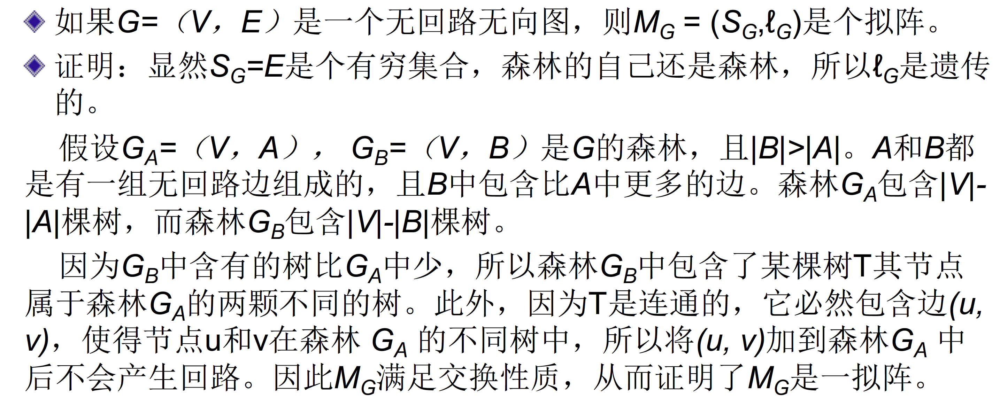

### 最大独立子集

+ 给定一个拟阵$M = (S,ℓ)$，$A∈ℓ$，元素$x ∉ A$，如果能在保持独立性的同时将x加到A中去，就称x为的A一个扩张
    + [例]图的拟阵$M_G$，如果$A$是一个独立的边集，则边$e$是$A$的一个扩张当且仅当$e$不在$A$中，且将$e$加到$A$中不产生回路。
+ 如果$A$是拟阵$M$的一个独立子集，且它没有任何扩张，则称$A$是最大的。
+ 定理16.6：某一拟阵中所有最大的独立子集的大小都是相同的

### 拟阵上的贪心算法

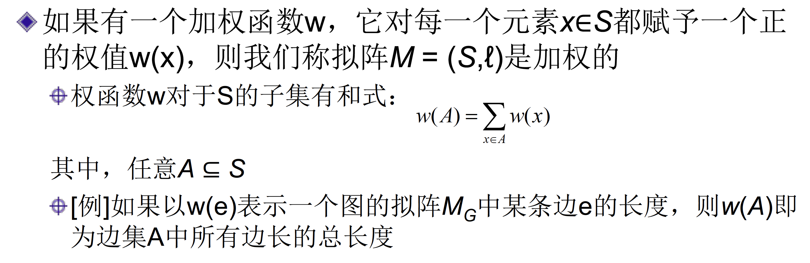

很多贪心问题，可以归结到拟阵上的贪心

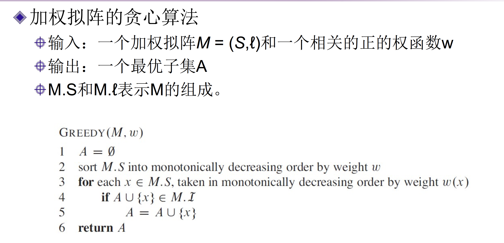
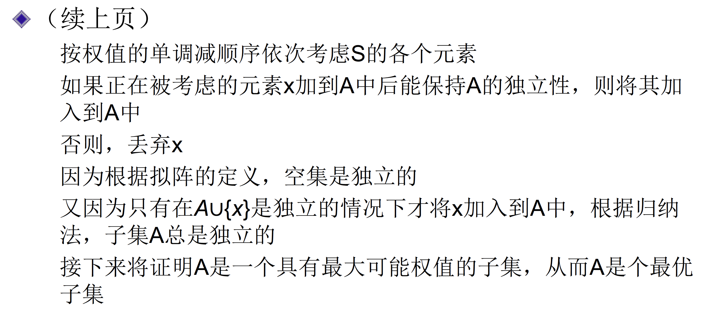

#### 拟阵贪心的运行时间

+ 设$n$表示$|S|$
+ GREEDY的排序阶段的时间为O(n lgn)
+ 第4行中对$S$中的每个元素执行一次，共$n$次
+ 在第4行的每次执行中要检查$A∪{x}$是否独立
+ 如果每次检查的时间为$O(f(n))$，则整个算法的运行时间为$O(n \lg n+ nf (n))$

### 正确性证明

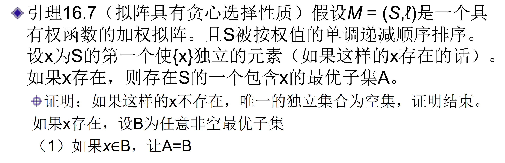
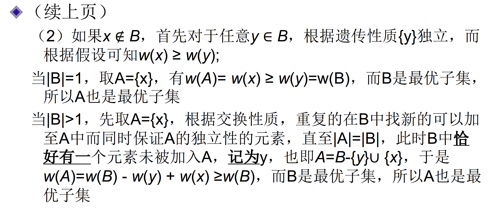
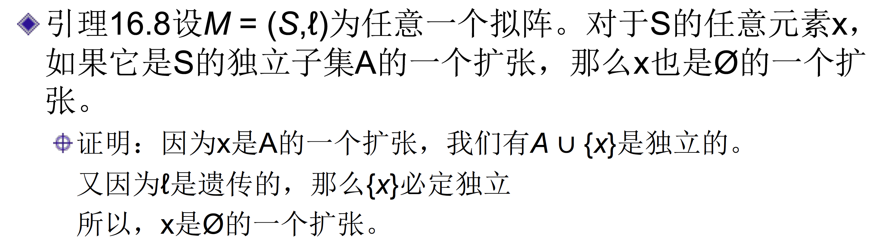
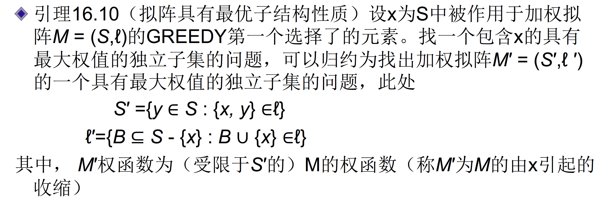
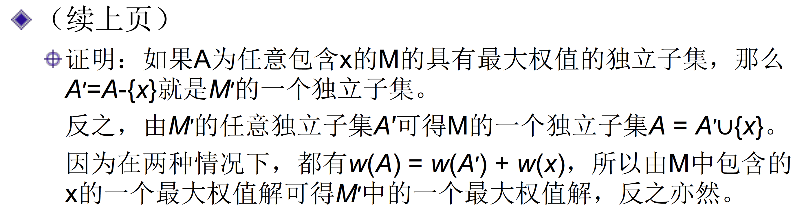
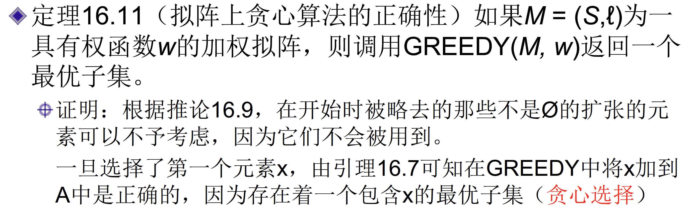
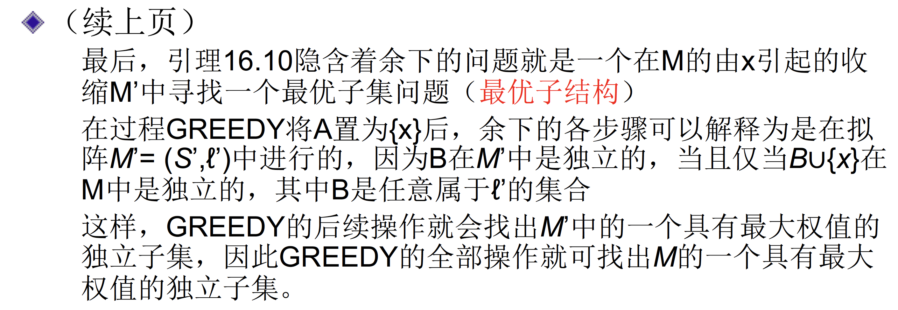

## 平摊分析

一系列不同操作的平均代价

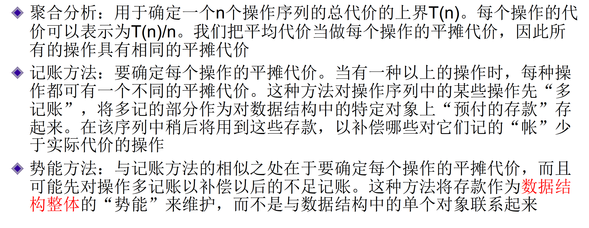

