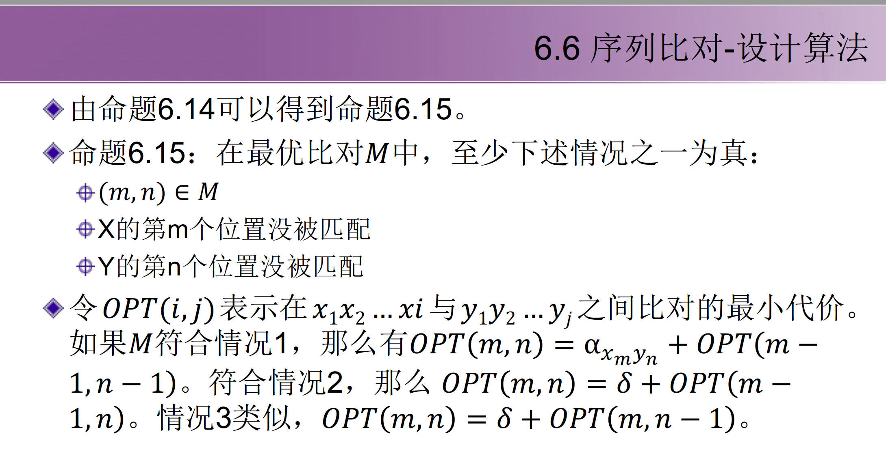
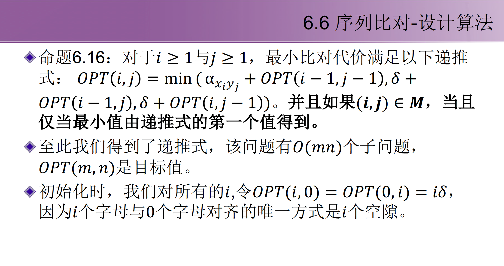
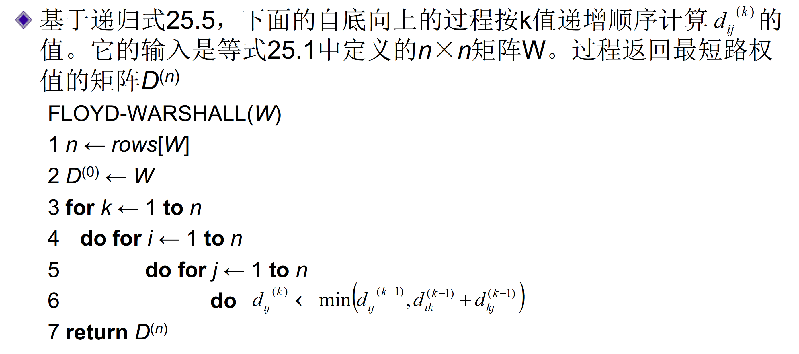
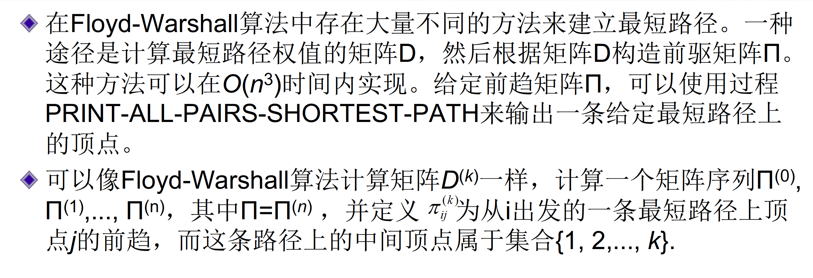
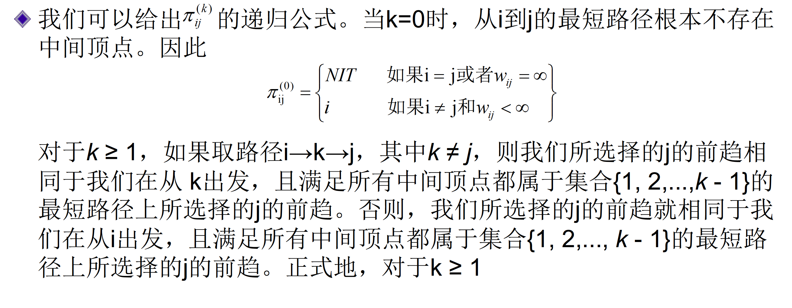

# 第四章 动态规划

从子状态最优，推导到下一状态最优，最后达到结果最优的目的

## 问题

### 带权的区间调度

### 分段最小二乘：多重选择

### 子集和问题

### 序列比对

考虑空间上的折叠，递推式只要$𝐴$中当前列和前列的信息，数组$𝐴$可以折叠成$𝑚×2$的数组$𝐵$

通过分治来恢复路径

### 图的最短路径

Bellman Ford找负圈：构建增广节点，所有连接指向它的边代价为0

判断指针图是否有环

#### Floyd-Warshall算法

$
Θ(V_3)
$

构造一条最短路径

<!-- ### 字符串编辑距离 -->

