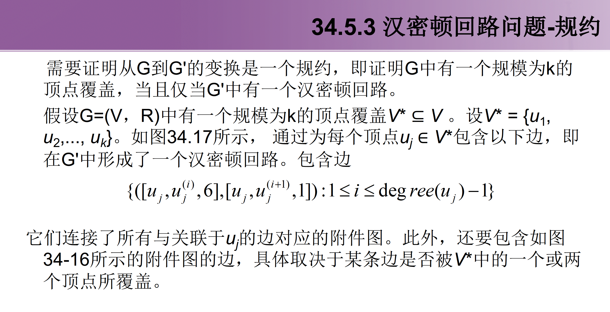

# 第六章 NP问题-NP完全性的证明

## 相关定义

### 多项式时间的算法

对于规模为$n$的输入，最坏情况下的运行时间是$O(n^k)$。

### P类问题

P类问题就是在多项式时间内可以解决的问题。更为确切地说，这些问题可以在时间$𝑶(𝒏^𝒌)$内解决，其中$𝒌$为某一常量， $𝒏$是此问题的输入规模。

### NP类问题

NP类问题就是指那些在多项式时间内可以被证明的问题。即，如果已知一个问题解的证书，那么可以证明此问题在该输入规模下能在多项式时间内解决。

常见的NP类问题

+ 哈密顿回路问题
+ 3-CNF可满足性问题

### NP完全问题

所有P类问题同时也是NP类问题

非形式地，如果一个NP问题和其它任何NP问题一样“不易解决”，那么我们认为这一问题是NPC类问题或称之为**NP完全问题**。

#### 证明

在证明一个问题是NP完全问题时，要依赖三个关键概念：

+ 判定问题与最优化问题
+ 归约
+ 第一个NP完全问题

#### 判定问题

一个判定问题是仅仅要求回答yes或no的问题。例如，停机问题就是一个判定问题。

**重要特性**：计算上对问题求解是困难的，但判定一个待定解是否解决该问题却是简单的。

#### 最优化问题

最优化问题：该问题每一种可能的解都有一个相关的值，我们的目标是找出一个具有最佳值的可行解。

注意：NP完全性不直接适合于最优化问题，但适合于判定问题，因为这种问题的答案是简单的“是”或“否”。

一个判定问题如果是困难的 ——> 它所对应的最优化问题也是困难的

### 归约

## 多项式时间

### 抽象问题

### 编码

### 形式语言体系

## NP问题-多项式时间验证与可规约性

### 多项式时间的验证

哈密顿回路：将证书的路径在图上扫一遍，验证正确性，$O(n^2)$的时间内实现

#### 验证算法

### NP完全性与可归约性

NP完全”问题有一种性质，即如果任何一个NP完全问题能在多项式时间内解决，那么NP中的每一个问题都存在一个多项式时间解，即P=NP。但目前没有找出任何NP完全问题的多项式时间算法。

解决了一个，就解决了所有问题

#### 可归约性

如果问题Q的任何实例都可以被“容易地重新描述”为Q’的实例，而Q’的实例的解也是Q的实例的解，那么问题Q可以被归约为另一个问题Q’。

我们说语言𝐿(在多项式时间内可以归约为语言$𝐿'$，记作$𝐿( ≤) 𝐿'$，如果存在一个多项式时间可计算的函数：$𝑓: \{0, 1\}^∗ → \{0, 1\}^∗$满足对所有的$𝑥 ∈ \{0, 1\}^∗，𝑥 ∈ 𝐿_1$(当且仅当$𝑓(𝑥) ∈ 𝐿_2$，则称函数𝑓为归约函数，计算𝑓的多项式时间算法F称为归约算法。

#### NP完全性

## NP问题-NP完全性的证明

NP完全性问题的证明结构

### 电路可满足性（CIRCUIT-SAT）

最经典的NPC问题，直接证明它的NPC性质，其他问题的NPC性质是由它归约而得的

#### 问题定义

+ 布尔组合电路是有布尔组合元素通过电路互联后构造而成的。布尔组合元素是指任何一种电路元素，它有着固定数目的输入和输出，执行的是某种良定义的函数功能。布尔值取自集合{0,1}。
+ 布尔组合元素计算的是一个简单的布尔函数，这些元素称为逻辑门。三种基本的逻辑门：NOT门（非门）、AND门（与门）、OR门（或门）
+ 每一种门及任何一种布尔组合元素的操作都可以用一个真值表来描述
+ 布尔组合电路由一个或多个布尔组合元素通过线路连接而成。一个电路将某一元素的输出与另一个元素的输入连接起来，即将第一个元素的输出值提供给第二个元素作为其输入值。
+ 虽然一根线上，不可能有多于一个的布尔元素的输出与其相连，但它可以作为其他几个元素的输入。由一个接线提供输入的元素的个数，称为该接线的扇出。
+ 如果没有哪一个元素的输出是接到某个接线上的话，则称该接线为电路的输入，它接受来自外部的数据。
+ 如果没有哪一个元素的输入连接到某根接线上的话，则称该接线为电
路的输出。
+ 一个布尔组合电路的真值赋值是指一组布尔输入值。如果一个单输出布尔组合电路具有一个可满足性赋值，**称该布尔组合电路是可满足的**

**电路可满足性问题**：给定一个由与、或和非门构成的一个布尔组合电路，判断它是否是可满足电路。

证明CIRCULT-SAT是NP类非常容易，遍历整一个图验证就可以了

接下来是NPC的说明，对于每一个NP难的问题，都可以在多项式时间内归约为CIRCULT-SAT。

### 布尔可满足性

归约办法，每一个电路的门都搞一个对应的布尔表达式

第一个图是一个布尔电路，第二个图是对应的SAT，方法就是这个门的输入输出是当且仅当的关系，使用一个双向箭头连接起来

### 3-CNF可满足性

布尔表达式，可以转化成一个二叉语法分析书

### 团问题

#### 定义

无向图$G=<V,E>$中的团是一个顶点子集$V‘ ⊆ V$，其中每一对顶点之间都由$E$中的一条边相连。团的规模是指它所包含的顶点数。
团问题：在图中是否存在一个给定规模为k的团？形式定义为：$CLIQUE=\{<G, k>:G是具有规模为k的团的图\}$

归约过程很容易验证

### 顶点覆盖问题

### 汉密顿回路问题

### 旅行商问题

定理：TSP问题是NPC的

首先证明TSP属于NP。给定该问题的一个实例，用回路中n个顶点组成的序列作为证书。验证算法检查该序列是否恰好包含每个顶点一次，并且对边的费用求和后，检查和是否为多为$k$。这个过程可以在多项式时间内完成。

接下来证明$\text{HAM-CYCLE} ≤_P \text{TSP}$。设$G=(V, E)$是HAM-CYCLE的一个实例。构造TSP 的实例如下.建立一个完全图$G' = (V, E')$, 其中$E' =\{(i, j) : i, j ∈ V \text{ and } i ≠ j\}$,定义费用函数$c$为

$$c=(i,j)\left\{\begin{array}{c}
0 \text{ 如果}(i,j)\in E \\1 \text{ 如果}(i,j)\notin E
\end{array}\right\}
$$

多项式时间完成，汉密顿回路等价于找一个代价为0的TSP回路

### 子集和问题

给定一个整数有限集和一个整数目标，判断是否存在有限集的子集，使得子集和恰好等于目标

对每个子句$C_j$，在$S$中都有两个对应的整数$s_j$ 和$s'_j$。在这两个数中，除了由$C_j$所标记的数位外，其他所有的数位上都是0。$s_j$在$C_j$上为1， $s'_j$在$C_j$上为2。这些整数是"松弛变量"，可以用来获取每个子句所标记的数位，从而可以将它们加到目标值4中。

$Φ$的一个可满足性赋值为：
$（x_1=0，x_2=0，x_3=1）$
$T=111 4444$
$v’_1, v’_2, v_3$
$s_1, s’_1, s’_2, s_3, s_4, s’_4$

