# 第七章 近似算法

## 概念

### 近似算法性能比

和最优解之间的比例

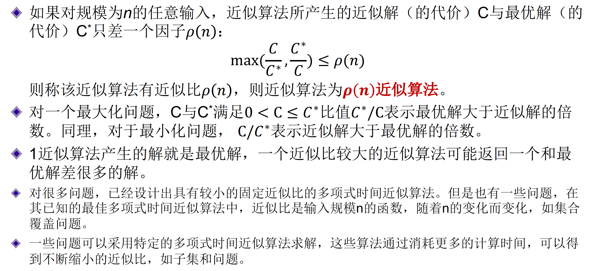

### 近似模式

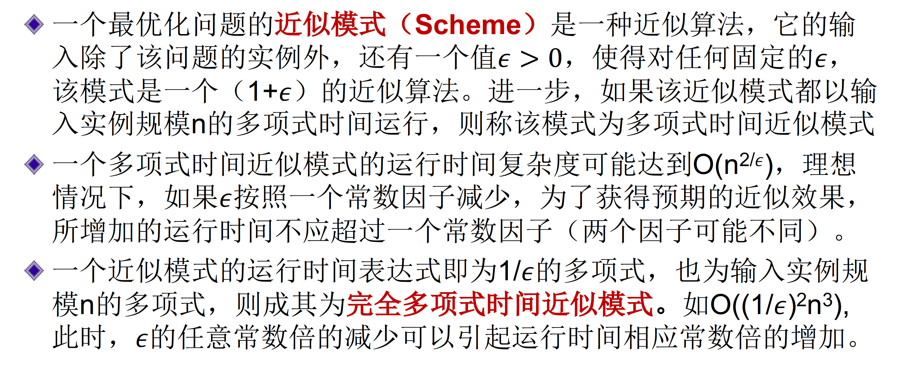

## 负载均衡问题

### 描述

+ 给定$𝑚$台机器$𝑀_1,…,𝑀_m$和$𝑛$项作业，每一项作业$𝑗$有处理时间$𝑡_𝑗$。
+ 目标是把作业分配给机器，使得所有机器的负载尽可能均衡。即最大负载的用时最小
+ 这是个NP难的问题

### 简单贪心

枚举所有作业，分配给当前复杂最小的机器

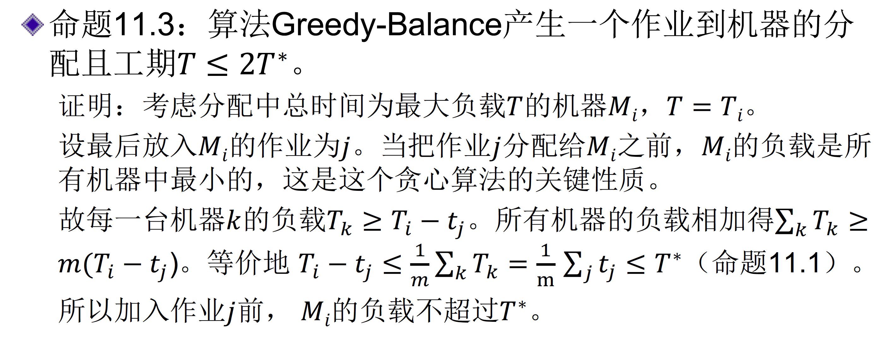
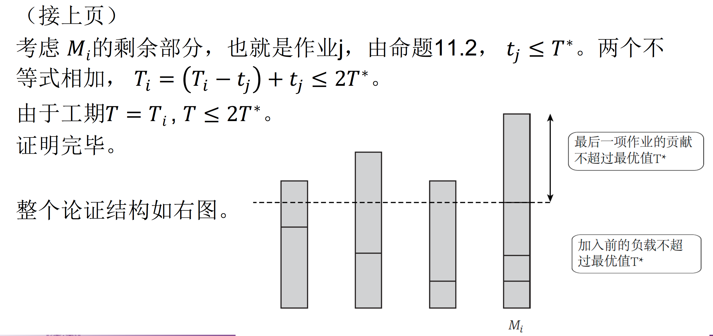

### 改进以后的贪心

给所有工作由大到小排序，然后进行循序选取

可以达到最优1.5倍的近似

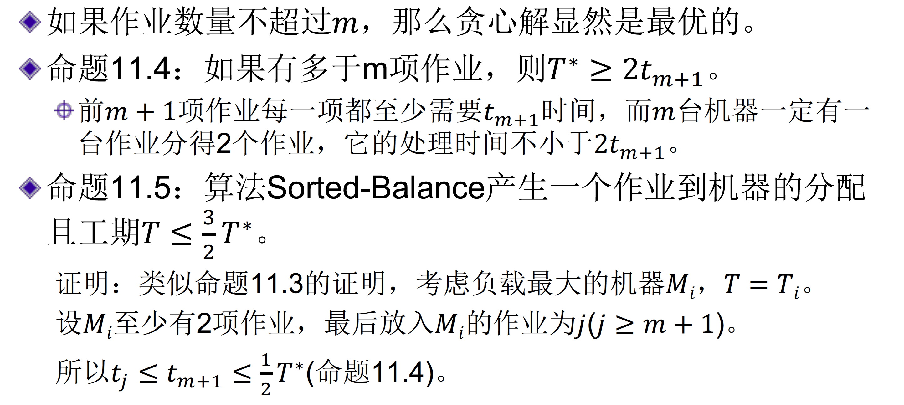
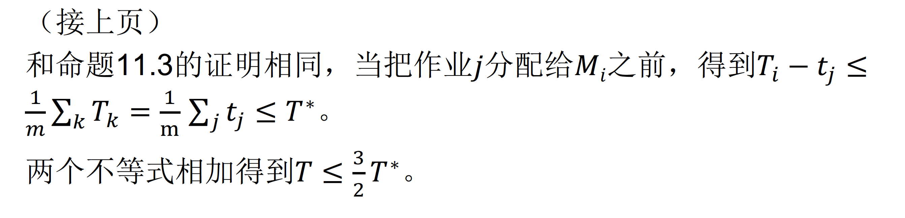

## 中心选址问题

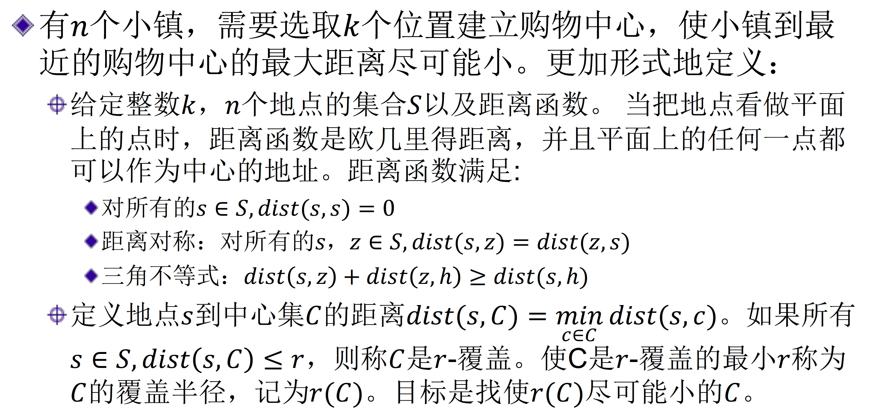

如果知道最优的半径$r$，我们可以设计一种贪心来找覆盖半径不超过$2𝑟$的$𝑘$个中心的集合

这是因为三角不等式的关系，我们可以直接令顶点为选址，每选一个就把距离为$2r$的给屏蔽掉。

根据这个性质，假定我们之前不知道$r$最优值是多少，我们可以选取$r_{max}$然后采用二分搜索的策略找一个较好的近似解。

### 一种贪心的策略

每次去选择离当前选择集合最远的地点，如果有离前面所有选择的中心不小于$2𝑟$的地点，那么这个最远的地点$𝑠$一定是它们中的一个。

**证明**：说明这种贪心的策略每一步都满足之前的策略条件

## 顶点覆盖问题

选择一批顶点照顾到每一条边

### APPROX-VERTEX-COVER

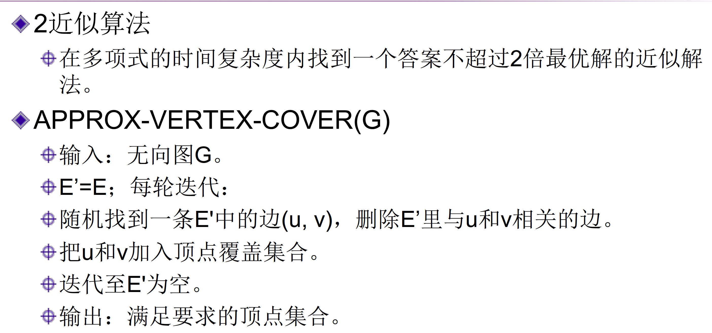

### 证明

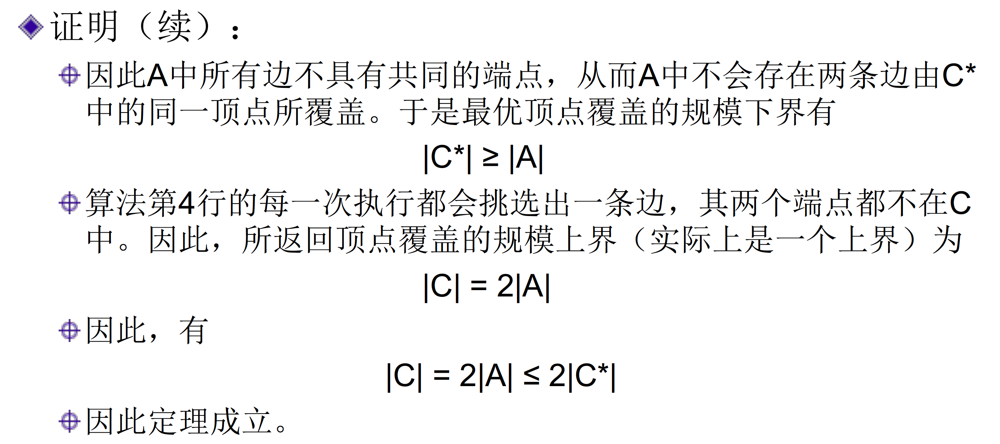

## 旅行商问题

如果地点之间的距离满足三角不等式，即对于顶点$u,v,w \in V$有$c(u,w)\leq c(u,v)+c(v,w)$

### TSP近似算法

这是一个多项式时间2近似算法

#### 算法证明

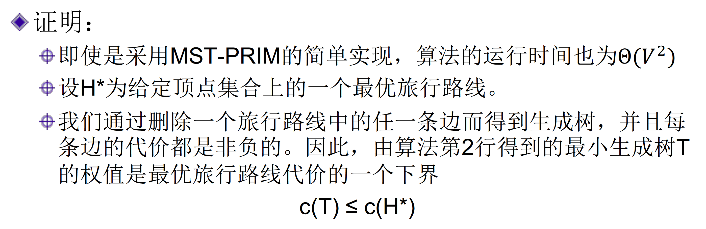
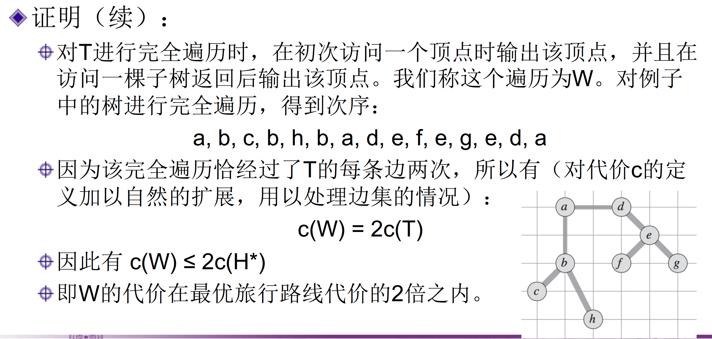
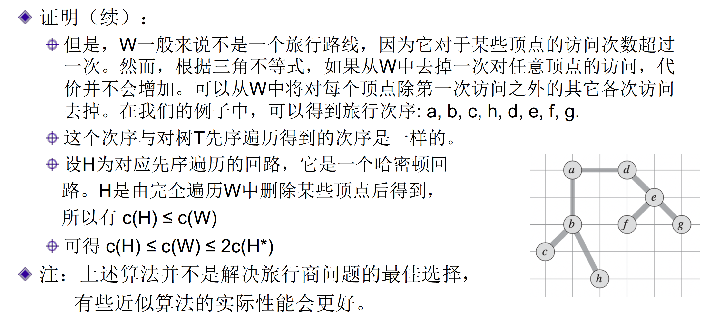

### 一般旅行商问题

不存在近似比为常数的算法，除非$P=NP$

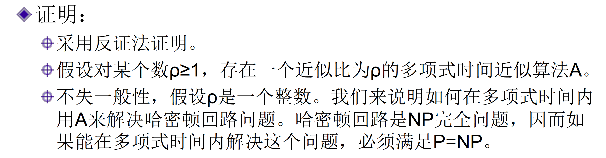
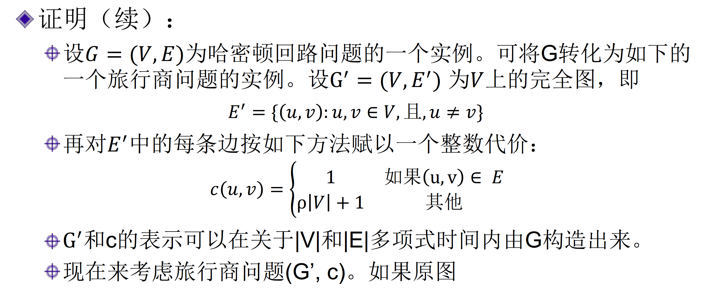
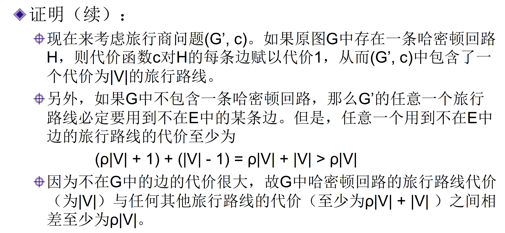
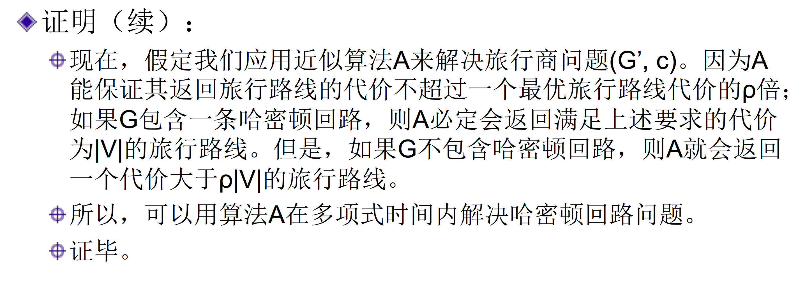

**思路**：基于HAM图设计一个TSP问题，使得有边的代价很小，没有边的代价很大，这样即使是一个近似算法最后也会去走有边的路，否则就达不到近似比了，这样就又产生了矛盾。

对于一般的情况，如果想证明没有近似算法，就反证说如果有，可以利用此去解决一个$NPC$问题

## 集合覆盖问题

### 问题定义

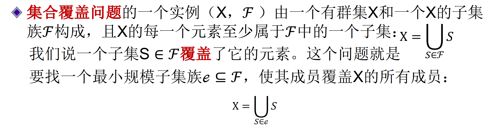

### 贪心近似算法

每一步都去选当前收益最大的子集和

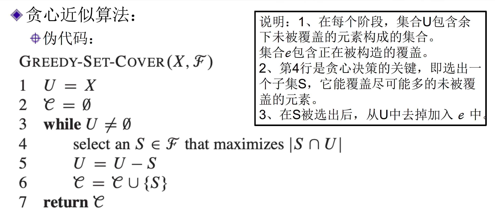

#### 复杂度计算

循环的迭代次数之多为$min(|X|,| ℱ |)$，循环体实现以时间$O (|X| | ℱ |)$运行

多项式时间复杂性：

$O (|X| | ℱ | min(|X|,| ℱ |))$

#### 近似比

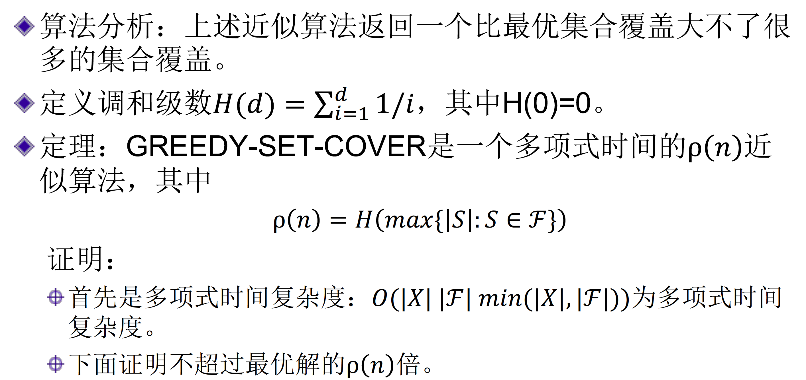

证明略

## 带权顶点覆盖问题

在之前的顶点覆盖问题上新增了一个权值，目标也是要把所有的边给覆盖了，但是最优化的目标变成了权值和

### 问题转换

+ 要求最小化$Σ_{v∈V} 𝑤(𝑣) 𝑥(𝑣)$ ，其中$𝑥(𝑣)$ 表示$𝑣$是否在点覆盖集合中。
+ 同时要求： 对每条$(u, v)$， $𝑥(𝑢) + 𝑥(𝑣) ≥ 1$同时$𝑥(𝑣)∈ \{0,1\}$
+ 可以看出是个0-1整数规划问题。
+ 当每个$w(v)=1$时就是一个顶点覆盖问题。

### 松弛成线性规划的问题

+ 对所有点$v，0<=x(v)<=1$。（原问题是$x(v)$必须是$0$或$1$）。
+ 因此问题就变换成了： $Σ_{v \in V} 𝑤(𝑣) 𝑥(𝑣)$
+ 满足：$\begin{aligned}
        x(u)&+x(v) \geq 1\\
        x(v) &\leq 1\\
        x(v) &\geq 1
    \end{aligned}$
+ 从而转变为线性规划问题。

求解以后，将值大于0.5的顶点放入结果集中

### 算法分析

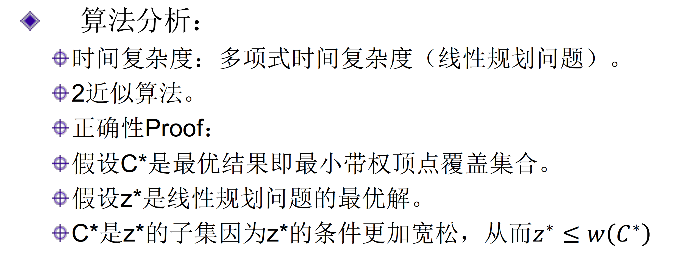
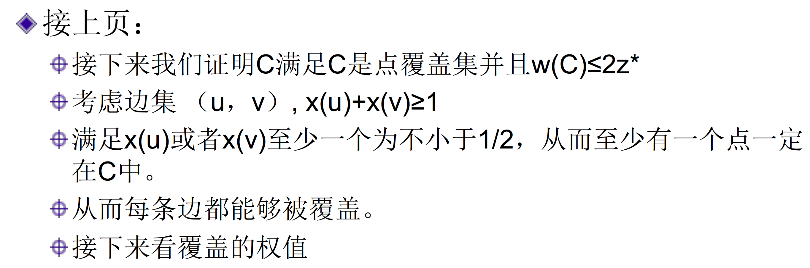
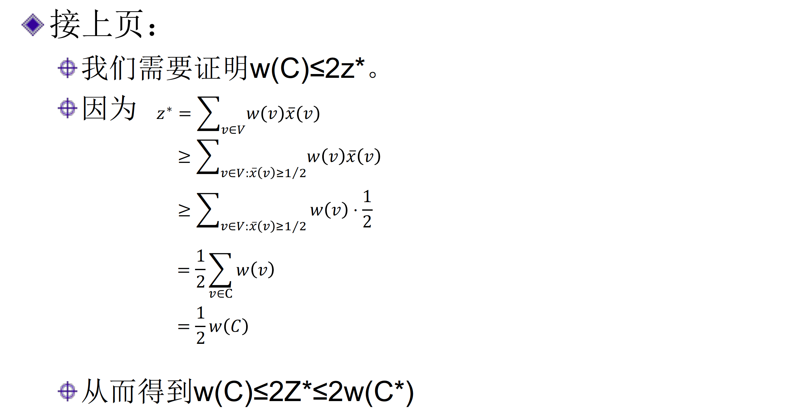

## 子集和问题

### 定义

对于一个正数集合$S$, ${𝑥_1, 𝑥_2,…, 𝑥_n}$给定一个数$t$，要求是否能找到一个子集属于$S$并且子集内元素和恰好为$t$。

注意：这是一个NPC问题

### 问题转化

找到一个尽可能大但不超过$t$的子集和

#### 方案一

指数时间复杂度精确算法

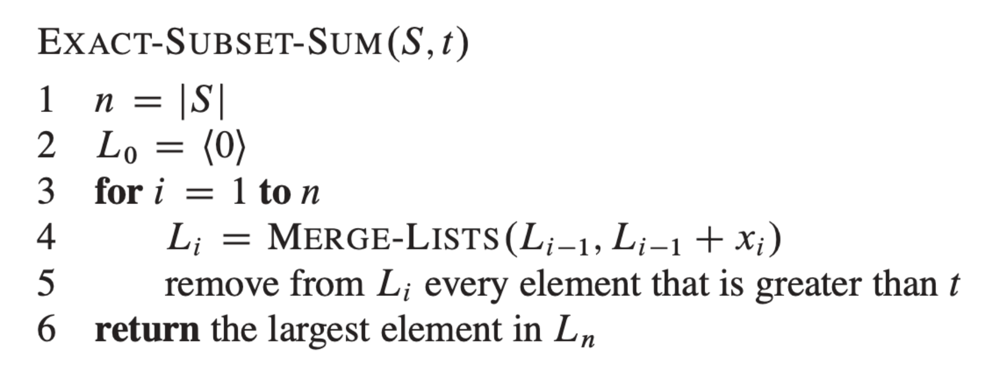

#### 方案二

完全多项式近似方案

+ 多项式时间复杂度近似算法。
+ 首先提出一个剪枝参数$δ$, $0 < δ < 1$
+ 根据这个参数将列表$L$剪枝成$L’$。
+ 根据这个参数需要剪去尽可能多的元素
+ $L$中所有元素$y$满足存在$L’$中的近似于$y$的元素$z$
+ 并且满足：$\frac{y}{1+\delta}\leq z \leq y$
+ 也就是说每个$y$可以被新列表中满足不等式的$z$表示出来。

剪枝的操作可以在线性的时间里完成

#### 方案三

根据剪枝的近似算法

+ 输入一个包含$n$个整数的集合$S=\{x_1,..., x_n\}$。
+ 我们给定一个近似参数$ϵ$，满足$0 < ϵ < 1$。
+ 它最后将返回一个值$z$。
+ 并且这个值落在最优解的$1 + ϵ$倍内。

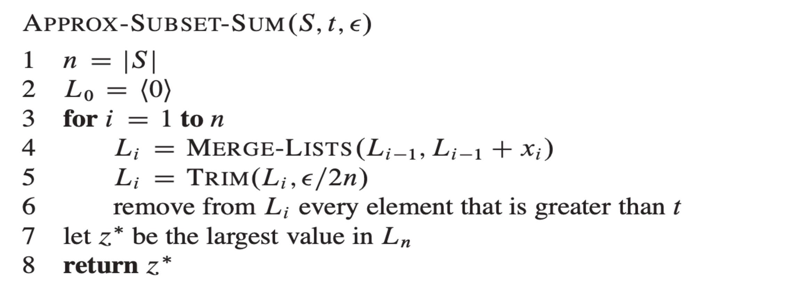

##### 分析

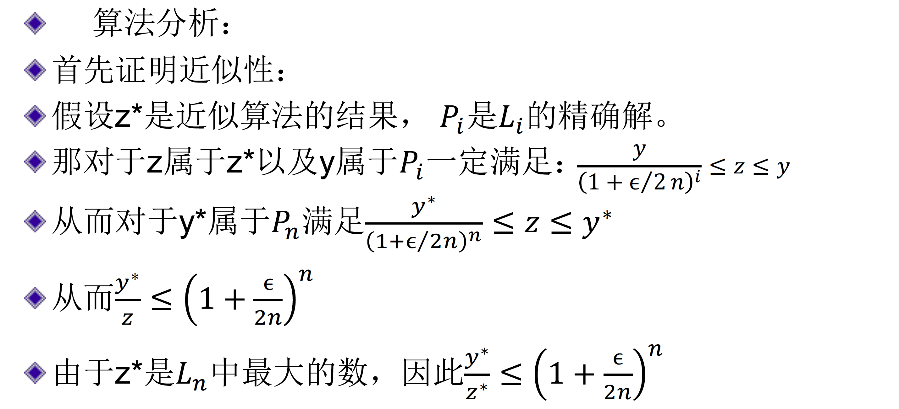
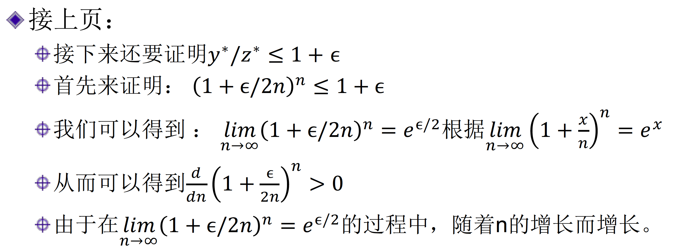
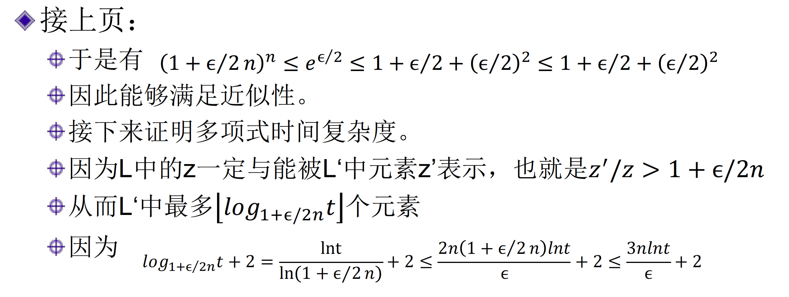

