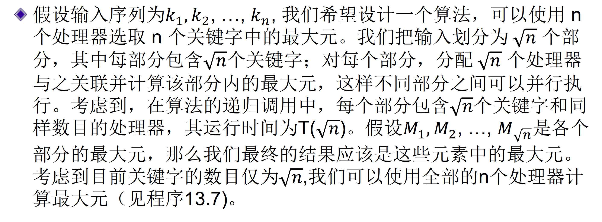
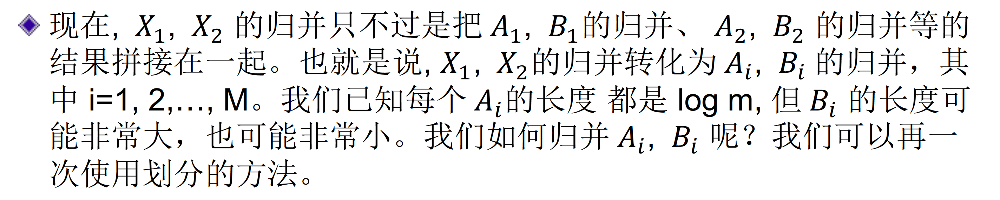

# 第八章 PRAM算法

## 算法介绍

### 概念定义

**加速比**：如果$\pi$是一个给定的问题，已知的最佳串行算法的运行时间为$𝑆^{\prime}(𝑛)$ ,其中$n$是问题的规模。如果该问题的一个并行算法在p-处理器计算机上的运行时间为$𝑇^{\prime}(𝑛, 𝑝)$，那么我们定义并行算法的加速比为$\frac{S^{\prime}(n)}{T^{\prime}(n,p)}$。

**线性加速比**：如果问题𝜋的已知最佳串行算法的渐进运行时间为$𝑆(𝑛)$，该问题的一个并行算法的渐进运行时间为$𝑇(𝑛, 𝑝)$，那么我们定义该并行算法的渐进加速比为$\frac{S(n)}{T(n,p)}$。如果$\frac{S(n)}{T(n, p)} = Θ(𝑝)$，那么我们称并行算法具有线性加速比。

**工作最优**：如果一个给定问题的p-处理器并行算法运行时间为𝑇(𝑛, 𝑝)，那么我们定义该算法的完成工作总量为𝑝𝑇(𝑛, 𝑝)，如果𝑆(𝑛)是解决该问题的已知最佳串行算法的渐进运行时间，那么我们定义并行算法的效率为$\frac{S(n)}{pT(n,p)}$另外，如果$𝑝𝑇(𝑛, 𝑝) = 𝑂(𝑆(𝑛))$，我们称并行算法是**工作最优**的。

命题：一个并行算法是工作最优的，当且仅当它具有线性加速比。另外，工作最优的并行算法的效率为$Θ(1)$。

#### Amdahl法则

并行处理给定问题的一种方法是考查多种算法并找出可并行性最高的那个算法。为达到高加速比，我们应尽可能地并行化每个底层算法组件。如果算法的一部分$f$ 无法并行化（即必须串行执行），那么可获得的加速比将受$f$ 制约。

**引理**: 最大加速比为

$$
\frac{1}{f+\frac{1-f}{p}}
$$

## 计算模型

### PRAM变种

+ **互斥读互斥写型(Exclusive Read and Exclusive Write,
EREW)**： PRAM是一种共享内存模型，其中全局内存中任何一个单元都不允许被（多个处理器）同时读或同时写。注意，这里的互斥读或互斥写并不包含不同处理器访问不同内存单元的情形。例如，在给定的时间步，处理器1 可能访问内存单元5，与此同时，处理器2 可能访问内存单元12，诸如此类。但处理器1 和2 不能同时访问内存单元10。
+ **并发读互斥写型(Concurrent Read and Exclusive Write,CREW)**： PRAM是另一个PRAM变种，它允许同时读但不允许同时写。
+ **并发读并发写型(Concurrent Read andConcurrent Write, CRCW)**：允许同时读和同时写

#### CRCW的变种

主要在写冲突下的处理机制不一样：

+ 在**一致(common) CRCW PRAM**模型中， 只有发生内存单元写入冲突的那些处理器试图写入相同的数据时， 并发写才被允许。
+ 在**随机(arbitrary) CRCW PRAM**模型中， 如果出现写入冲突，其中之一的处理器将成功写入内存单元，但我们并不知道哪个处理器成功地进行了内存写入。为这个模型设计的算法必须保证， 无论哪个处理器在冲突过程中成功写入，算法都能够正常工作。
+ 在**优先级(priority) CRCW PRAM**模型中，出现写入冲突时，优先级最高的处理器可以进行成功的写入。通常地， 每个处理器最初都被赋予一个（静态）的优先级。

**注意**：$p$ 个处理器的EREW PRAM上、运行时间为$T(n,p)$的任何算法， 可以在$p$ 个处理器的CREW PRAM或CRCW PRAM上运行，时间不超过$T(n,p)$，其中$n$ 是问题的规模。但在保持渐进运行时间的前提下，CRCW PRAM或CREW PRAM上的算法可能无法在EREW PRAM上实现。

不同类型PRAM计算能力的层次结构

$$EREW(p,T(n,p)) ⊂ CREW(p,T(n,p)) ⊂一致型CREW(p,T(n,p)) ⊂\\
随机型CRCW(p,T(n,p)) ⊂ 优先级型CRCW(p,T(n,p))$$

### 减速引理

在$p$ 个处理器的计算机上、运行时间为T 的任何算法，可以在$p^{\prime}$ 个处理器的计算机上运行，运行时间为$O(\frac{p^T}{p^{\prime}})$

所以在设计算法的时候只考虑处理器尽可能多的场景

## 基本技巧和算法

### 前缀计算问题

给出一个CREW PRAM上的算法，使用$\frac{n}{\log n}$个处理器，运行时间为$Θ(logn)$。注意到这个算法的完成工作总量是$O(n)$， 故算法的效率为$O(1)$， 是工作最优的。同时，算法的加速比为$Θ(\frac{n}{\log n})$。

假设输入为$x_1,x_2,\dots,x_n$，假设$n$是$2$的幂次，给出使用$n$个处理器，运行时间为$O(\log n)$的算法

采用分治的策略，首先把所有输入以$\frac{n}{2}$分成左右两块，然后递归求前缀和，求完以后后半部分并行读取前半部分的最后一个并做更新，如此整一个前缀和就求完了。

复杂度的递归表达式

$T(n)=T(n/2)+\Theta(1)$

这样是$\Theta(\log n)$的时间复杂度，不是工作最优的算法

#### $\frac{n}{\log n}$个处理器的情况

首先每一个处理$\log n$个输入，得到局部的前缀和。接下来选取每组的最后一个（总共$\frac{n}{\log n}$）进行前缀和的更新，然后再把每组的前缀和都给更新了。

### 表排列问题

表排列问题是指，对链表中的每个节点，计算其右侧节点的个数(也称为节点的秩(rank of the node))。由于节点中包含的数据与表排列问题本身无关，我们假设每个节点只包含一个指向其右邻居的指针，特别地，最右侧节点的指针为空指针。

#### 确定性表排列

每次跳跃的距离都会变成原来的两倍，最多进行$\log n$次跳跃

#### 随机化表排列

剪辑过程(下面拼接、剪辑的顺序表错了)

**分析**

算法解释：说白了跳表的操作不需要按什么顺序都能进行，因为秩在实际上是一个求和的操作，只要每一个节点都跳一次最后就是求得出来的，随机化的好处是防止产生冲突

## 选取

### 定义

选择问题，问题的输入为$n$个关键字构成的序列及一个整数$i$, 其中$1 ≤ 𝑖 ≤ 𝑛$。在本节中， 我们研究选择问题的并行算法的（时间）复杂度。我们针对一系列特定情形给出算法。

### 使用$n^2$个处理器选取最大元

复杂性很容易证明，加速比为$\Theta(n)$，算法效率为$\Theta(\frac{1}{n})$，不是工作最优的

### 使用$n$个处理器达到$O(\log \log n)$的效率

在这里因为$n^2$在$O(1)$时间就能处理，所以选择$\sqrt{n}$作为划分的刻度

### 整数范围的最大元

结论：如果每个关键字都是$[0, 𝑛^c]$ 范围内的整数，其中$c$是常数，那么我们有工作最优的、运行时间为$O(1)$算法。算法的加速比为$Θ(n)$，效率为$Θ(1)$。

### 使用$𝑛^2$个处理器进行一般性选择

还得仔细地看一看

## 归并

假设$𝑋_1 = 𝑘_1 , 𝑘_2 ,…, 𝑘_m$和$𝑋_2 = 𝑘_{m+1} , 𝑘_{m+2} ,…, 𝑘_{2m}$是两个有序序列，我们要对其进行归并。不失一般性地，我们假设整数$m$ 是$2$ 的幂次， 关键字互不相同。注意，归并问题可以转化为计算每个关键字$k$ 在$𝑋_1 ∪ 𝑋_2$中的秩。如果我们已知每个关键字的秩，那么我们把秩为$i$ 的关键字写入到全局内存单元$i$ 中，即可完成关键字的归并。如果我们使用$n = 2m$ 个处理器， 上述写操作只需要一个单位时间。

对任意关键字k, 我们把它在$𝑋_1(𝑋_2)$中的秩记为$𝑟^1_k(𝑟^2_k)$。如果$𝑘 = 𝑘_j ∈𝑋_1$, 那么$𝑟^1_k= 𝑗$。如果我们将一个处理器$\pi$与$k$ 关联，那么$\pi$可以在$X_2$中执行二分搜索并确定$X_2$中小于$k$的关键字的个数， 记为$q$。只要$q$已知， 处理器$\pi$以计算关键字$k$ 在$𝑋_1 ∪ 𝑋_2$中的秩， 即$j + q$。如果$𝑘 ∈ 𝑋_2$, 我们可以用类似的过程计算其在$𝑋_1 ∪ 𝑋_2$中的秩。总结一下，如果我们使用$2m$ 个处理器（即每个关键字对应一个处理器），归并可以在$O(\log m)$时间内完成。

该算法不是工作最优的

### 奇偶归并

一种基于分治策略的归并算法，具有良好的可并行性。假设$𝑋_1 = 𝑘_1 , 𝑘_2 ,…, 𝑘_m$和$𝑋_2 = 𝑘_{m+1} , 𝑘_{m+2} ,…, 𝑘_{2m}$ （其中整数$m$是$2$ 的幂次）是两个有序序列， 那么程序13.10 使用$2m$ 个处理器进行归并。

举例：

时间复杂度$T(𝑚) = 𝑂(\log 𝑚)$

### 工作最优算法

### 运行时间更快的算法

两个长度为$m$的有序序列，使用$2m$个处理器，归并只需要$O(\log \log m)$的时间。

思路：转化成$\sqrt{m}$个子问题，归并长度不超过$\sqrt{m}$的子序列。

## 排序

如果我们使用$𝑛^2$ 个处理器，我们可以在$O(\log n)$时间内并行地比较每个可能的关键字对并得到每个关键字的秩。一旦我们知道每个关键字的秩，只需一次并行写操作即可将各个关键字有序的排列（将秩为i 的关键字写入到第i 个内存单元中）。

### 奇偶归并排序

### Preparata算法

## 图问题

辅助矩阵定义

举例：有向图的联通性

图的PRAM定理

### Kruskal并行算法

直接分析每一条边，用$O(\log n)$判断它是否在最终的图里，判断比它小的边的集合里是否会把边的两个点连起来

### 传递闭包的优化

### 全点对的最小路径问题

